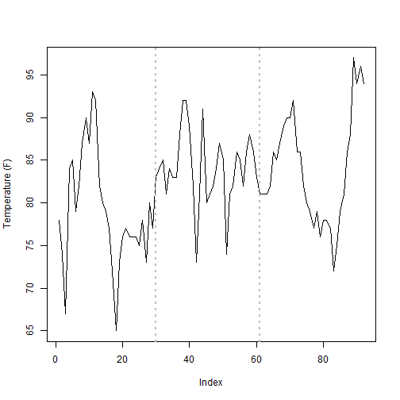

Course Project: Shiny Application and Reproducible Pitch 
========================================================
author: Gerrit Timmerhaus
date: 17 May 2016
autosize: true

Overview
========================================================

This course project consists of creating a shiny application and the documentation of it.

The application is available here: <https://gedit.shinyapps.io/DevDataProducts/> 

The code for server.R and ui.R are available on github: <https://github.com/Gedit/devDataProd> 

Functionality
=======================================================

The shiny application uses the **airquality** data set, which contains air quality and climate data in New York from May to September 1973. The objective of this application is to provide visualization of the data of selected time intervals.

There are four variables in the data set, which can be visualized:
- Ozone (ppb)
- Solar radiation
- Wind (mph)
- Temperature (F)

The user can choose which of the four variables should be visualized in the plot.

The user can also choose which time interval (by month) should be visualized.


Input
======================================================

A pull down menu allows to select one of the four **Variables**.

The slider **Month** can be used to select which months should be displayed (5 = May to 9 = September). 

The plot will be updated each time another variable was chosen or the time interval was changed. 

Within the plot, grey dotted lines indicate the beginning of a new month.

Example
========================================================

A user wishes to display the temperature from June (=6) to August (=8).
This information will be translated in **server.R** as follows:


```r
temp <- subset(airquality, airquality$Month >= 6 & airquality$Month <= 8) 
x <- temp[,as.numeric(4)]
labs <- c("Ozone (ppb)", "Solar radiation", "Wind (mph)", "Temperature (F)")
plot(x, type="l", ylab=labs[as.numeric(4)])
abline(v=which(diff(temp$Month)==1), lty=3, col="grey", lwd=2)
```



The plot shows the temperature from June to August. The new months are indicated by grey dotted lines.

